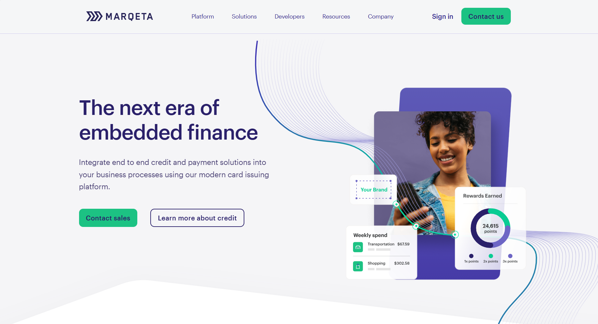
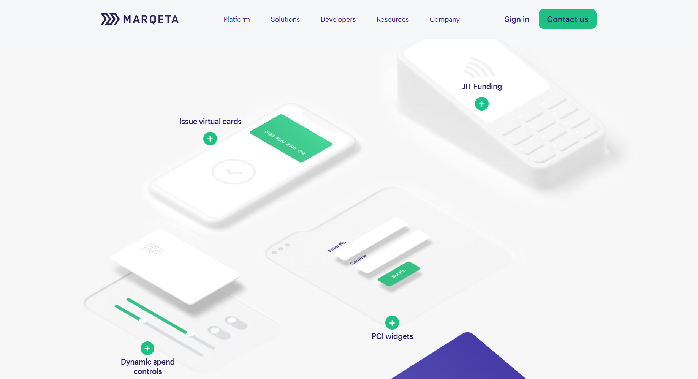
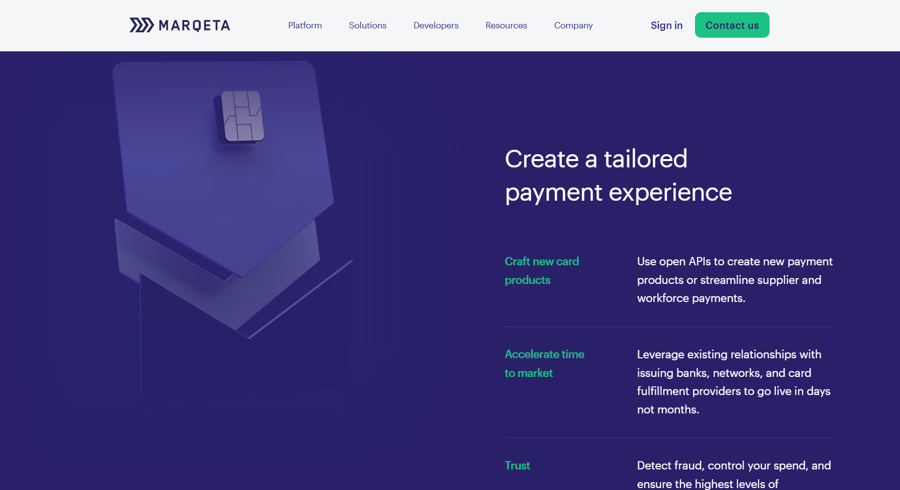
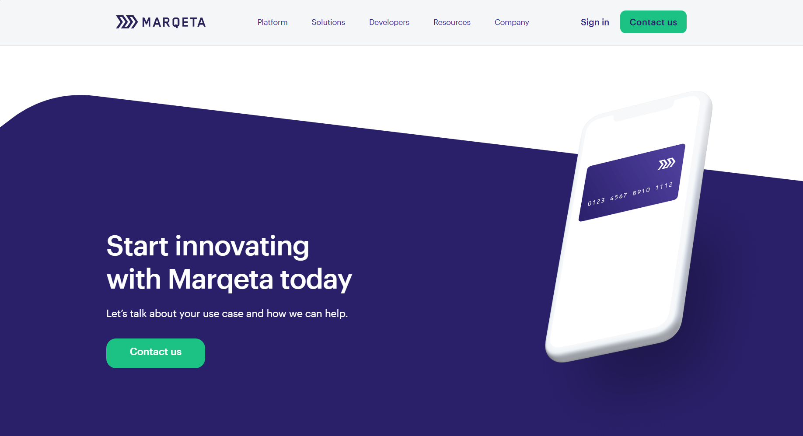

# Marqeta Website Clone Assignment

🌐 Website: [marqeta-ui.vercel.app](https://marqeta-ui.vercel.app/)

    This project is a clone of Marqeta as part of the assignment. The task is to develop a 
    clone of the provided web page and host it. The project involves implementing various 
    animations and ensuring the overall structure and performance of the website are up 
    to standards.

<video loop controls autoplay muted src="marqeta-demo - Made with Clipchamp.mp4" title="Title"></video>

<div style="display: grid; grid-template-columns: repeat(2, 1fr); gap: 10px;">
  
  
  
  
</div>

## 🤌🏻 Introduction

This assignment aims to replicate [Marqeta](https://www.marqeta.com) Sample using React and GSAP for animations. The primary focus is on component reusability, state management, CSS style guide adherence, and webpage performance.

## 🎉 Features

- [✔️] **Mandatory Card Animation**: Card animation implemented starting from the first section.
- [✔️] **Additional Animations**: Implemented text and element animation on scroll using GSAP and potentially other libraries.
- [✔️] **Static UI**: Reuse static HTML/CSS code from the provided website.
- [✔️] **React Component Structure**: Emphasized reusability and readability.
- [✔️] **State Management**: Proper state management using React hooks.
- [✔️] **CSS Style Guide**: Following a consistent CSS style guide.
- [✔️] **Webpage Performance**: Ensuring the website is optimized for performance.

## 🕹️ Technologies Used

- React
- Vite
- Javascript
- GSAP
- ScrollTrigger
- Webpack
- Babel
- HTML5/CSS3
- Dot Lottie
- Owl Carousel

## ⚡ Performance

The website optimizes performance by lazy loading components and assets, minimizing render-blocking resources, and optimizing images.

## 🪄 Credits

[Marqeta](https://www.marqeta.com) - The source of inspiration for this project.

## 🏃🏻‍♂️ Run Locally

Clone the project
```
    https://github.com/debrajhyper/marqeta.git
```
Go to the project directory
```
    cd marqeta
```
Install dependencies
```
    $npm install
```
Start the dev server
```
    npx vite --port=4000
```